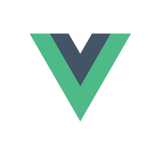

# MEVN scaffold

Code scaffold for projects with docker. 

&nbsp;&nbsp;&nbsp;&nbsp;&nbsp;&nbsp;&nbsp;&nbsp;&nbsp;&nbsp;&nbsp;&nbsp;&nbsp;&nbsp;&nbsp;

Separate <a href="backend/">backend</a> and <a href="frontend/">frontend</a> development stack managed under <a href="https://vuejs.org/v2/style-guide/" target="_blank"> Vue style guide</a>, <a href="https://router.vuejs.org/" target="_blank"> Vue router </a> and <a href="https://vuex.vuejs.org/" target="_blank"> Vuex </a> are implemented. <a href="https://www.mongodb.com/" target="_blank">MongoDB </a> + <a href="http://expressjs.com/" target="_blank">Express </a> + <a href="https://vuejs.org/" target="_blank"> VueJS </a> + <a href="https://nodejs.org/en/" target="_blank">NodeJS </a> code scaffold for projects and Dockerfile included.  <a href="https://vuetifyjs.com/en/" target="_blank">Vuetify </a> as a material design framework and <a href="https://sweetalert2.github.io/" target="_blank">Sweet alert2 javascript pop-up boxes.</a>  Environment variables handled with <a href="https://www.npmjs.com/package/dotenv" target="_blank">dotenv.</a>  Backend unit testing with <a href="https://mochajs.org/" target="_blank">Mocha</a>.</a>  Frontend unit testing with <a href="https://jestjs.io/" target="_blank">Jest</a>   Frontend BDD testing with <a href="https://cucumber.io/" target="_blank">Cucumber</a> and <a href="https://selenium.dev" target="_blank"> Selenium </a>

<a href="https://mevn-scaffold.herokuapp.com" target="_blank">Live demo</a>

## Prerequisites

 - MongoDB
 - Express 
 - Vue
 - Node
 - Docker

### How do I start?

1. Clone this repository.   
2. Go <a href="backend/">Backend</a> folder to set up and run the api server. 
3. Go <a href="frontend/">Frontend</a> folder to set up set up and run the app.

#### License
See the [LICENSE](LICENSE.md) file for license rights and limitations (MIT).
